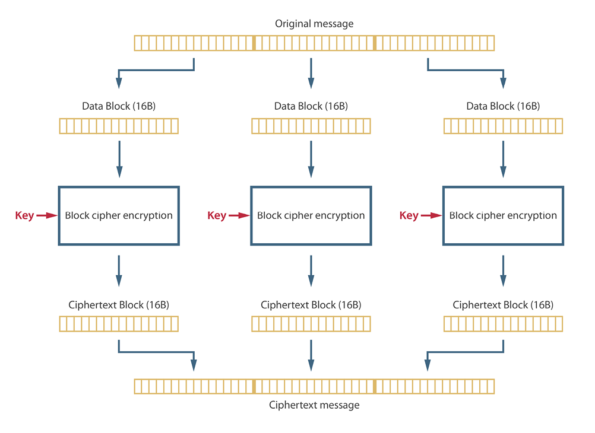

Authors:

- 0x42697262
- Jinx
- Orochi

# Symmetric Key Cryptography

## Semantic Cryptography

### IND-CPA

**Indistinguishability under chosen plaintext attack** or **IND-CPA** refers to a game used to check CPA security on any given encryption method.
The game works like this:

1. The encryptor ($Enc$) will give out a public key to the attacker ($A$) while keeping the private key.
2. A will then give two same-length messages $m_0$ and $m_1$ to the $Enc$.
3. $Enc$ will choose a random bit $b \in \{0, 1\}$ to encrypt both messages.
4. $Enc$ will give out $C_0$ to the $A$.
5. $A$ will guess $b\prime$, and if $b\prime = b$, then $A$ will win.

Another way of referring to the win conditions of this game is the **_Probability of_** $A$ **_winning_** $\bf{-1/2 + \varepsilon}$, where $\varepsilon$ is a very small number.
This means that an encryption method will be CPA secure if the attacker has a very negliglible advantage in winning the IND-CPA game.

The formal definition of having achieved CPA security is:

$$
\text{An encryption method is CPA secure if}\ \forall\ m_0\ \text{and}\ m_1\ \text{such that}\ \vert m_0 \vert\ =\ \vert m_1 \vert\ \forall\ A
$$

$$
A^{Enc}(Enc(m_0)) \approx A^{Enc}(Enc(m_1))
$$

To sum up the definition given above, an encryption method will be CPA secure if for all pairs of messages that have the same length, the probability to guess $b$ on $m_0$ must be approximately equal to the probability to guess $b$ on $m_1$.

So, if the encrypted message is distinguishable other than from randomness, then its not CPA secure.
### ECB

The **Electronic Code Book** or **ECB** is a simple encryption method that incorporates a block cipher. 

It splits the plaintext into different blocks of the same size, usually 16 bytes. Each block is independently encrypted with the encryption key, which results in identical blocks having the same ciphertext after encryption.

Considering the nature of ECB, we can make a "*code book*" of all possible ciphertext of any given key. With this "*code book*", encryption is made possible by looking up the plaintext and choosing the corresponding ciphertext of the given key, thus the method is aptly named.

### Is ECB IND-CPA secure?

The ECB encryption method is not IND-CPA secure due to its deterministic characteristic. The nature of the ECB makes it so that identical blocks of plaintext have the same ciphertext, leaving patterns present in the plaintext to be left behind in the ciphertext. This makes it vulnerable to pattern recognition and frequency analysis. 

Take this for example:

> If $m_0$ refers to the plaintext *"timewaitsfornoone"* and $m_1$ refers to the plaintext *"sometimeinthefuture"*, and each block will contain 4 bytes each, are there any identical blocks?

The block *"time"* appears in both plaintext, and when encrypted with the same key, will result in the same ciphertext.

By exploiting the repetitive patterns resulted from identical plaintext, the attacker in the IND-CPA game will have a significant advantage in figuring out what $b$ they used in encryption.

Meaning that ECB is not IND-CPA secure due to its inability to be indistinguishable under a chosen-plaintext attack.

## IND-CPA Secure Cryptography