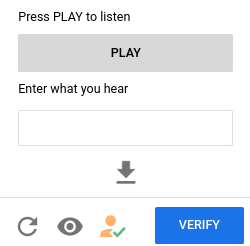

Authors:

- 0x42697262
- Jinx
- Orochi

**To prove that you are human, please complete this [assessment](https://www.youtube.com/watch?v=dQw4w9WgXcQ) first.**

Once done, please proceed to the writeup below. 
Thank you.

---

# CAPTCHAs

Having used the internet for over 14 years, CAPTCHAs can be just as annoying as pop-up ads when you lack a decent adblocker.
Sure, CAPTCHAs can be annoying, but they actually stop those pesky bots from disguising themselves as real users.

This helps keep websites running smoothly and prevents you from experiencing slow, frustrating service.
But having to solve them every single time, especially on brand new sites, can be incredibly frustrating.

## Why it only works on the surface level

CAPTCHAs does not even work (when looking at every possible ways to bypass CAPTCHAs).

Sure, CAPTCHAs aren't perfect.
A determined attacker with enough resources could probably crack them eventually.

Take this simple multiplayer [game](https://agar.io).
They added CAPTCHAs to fight the growing problem of bots trying ruin the game for everyone.

Every now and then, you get hit with a CAPTCHA test just to spawn into the game.
Frustrating, right?

Moneyclip's— err, Miniclip's goal was to prevent bots from overwhelming the game server.
However, that doesn't seem to be working, as there are still bots present in the game.

Anyone can simply reuse a valid CAPTCHA token or response to spawn bots and start causing disruptions.
People just keeps finding ways to bypass CAPTCHAs.

**Granted, CAPTCHAs stop the super lazy cheaters from using bots, but the competent ones can still figure them out.**
Bummer, right?
It helps a bit to keep things fair, but it also makes things annoying for legit players who just wanna have fun.

The CAPTCHAs are a real pain, not just in games!
You try to do something quick online, and bam, you're stuck with one of those traffic light picture things.
Thirty seconds isn't so bad, but it's still annoying when you just want to get stuff done.

The worst part?
Having to do that counterproductive CAPTCHA thing **over and over** because apparently you didn't click the right fire hydrants the first time.
Come on, just let me log in already.

...And then you do it **again**, and **again**, and again.
It's like wasting your life away clicking on blurry buses for a good two or three minutes before you can finally get on with your day.
Yay! CAPTCHAs!

**And then there are those delightful moments** where you have to reload the entire page because the CAPTCHA session has expired and your hard-earned answers are no longer considered valid.

Well, buckle up and get ready to **re-enjoy** the CAPTCHA test once again!
Maybe it's just a matter of honing your skills in identifying blurry storefronts at lightning speed.
A skill issue.

*What if I am actually a robot?*

*Should I stop poking around `robots.txt`?*

*Or could it be my proxy or VPN is the cause?*

*Nada, it's the fault of the captcha.*
It has to be.

## But muhh server!

Rumor goes around that half of the users on the internet are actually robots.
Can't deny nor confirm.

In the point of view of developers, CAPTCHAs are an effective way to prevent bruteforce attacks on the website.
As well as spammers and botters.
It is a simple tool that can prevent attacks in the wild.

It works well for small web servers that cannot handle a lot of traffic or online stores that are vulnerable to bots.
But then again, botters can still win and bypass the CAPTCHAs.
Even someone who has no knowledge about technology can bypass CAPTCHAs.

For example, you can install [buster](https://github.com/dessant/buster) as a browser extension.

And simply select the icon-button and enjoy bypassing it for free.
What buster did was to use artificial intelligence to bypass the audio test by using speech-to-text recognition.

This attack focused on user accessibility, allowing us to bypass the CAPTCHA test.
Because not everyone have eyes that can see, thus an audio test is implemented for handicapped individuals.

Well, this is inefficient if you wanted to create a bot that can overwhelm a server.
But the same methodology can be applied to bypass Google's reCAPTCHA (bypassing Cloudflare's hCaptcha would require [Privacy Pass](https://blog.cloudflare.com/privacy-pass-standard) provided by Cloudflare) depending on the resources available.
However, that is still quite inefficient.
The most effective way to bypass CAPTCHAs is to pay people around the world to solve the CAPTCHAs for you.
If you have seen job postings that mentions _Work passively anytime!_, _Only typing!_, or _Earn $$$ within X hours!_ (non-verbatim), then that is what CAPTCHA solver services thus.
They offer a paid plan for you to buy and then use it to bypass CAPTCHA tests.

## This writeup is definitely not written by a bot

*So, are CAPTCHAs worth it?*
Eh, it really depends on which point of view we are looking at.
If majority uses CAPTCHAs to deter bots, spammers, and bruteforce attacks then they are worth it.

*Do I think they work?*
Yes, they work but not 100%.
CAPTCHAs are an extra layer to security to web servers.
It is not a magic bullet that stops all bots.
If it were, then that server simply does not accept any request then.
It wouldn't be called a server at this point.

*Is it more trouble than it is worth?*
As a developer, no.
As a user, yes.
But over time, users would just accept the fact that CAPTCHAs are part of the internet and becomes ingrained with them.
Making the pain a part of browsing the internet.

## What's the alternative then?

Attesters.
Not [this](https://github.com/explainers-by-googlers/Web-Environment-Integrity/issues/28) attester.
That's simply terrible and breaks the internet due to browser monopoly.

Okay, maybe not attesters but surely CAPTCHAs that checks your digital fingerprints *might* be a good way to validate your existence is either a human or a robot.
